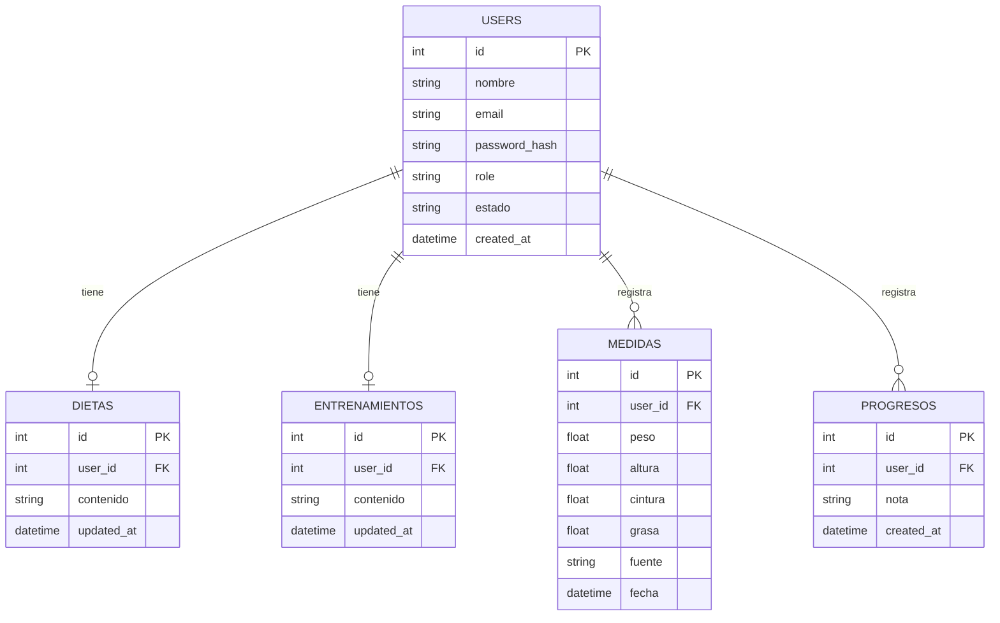

# BIY SQLite - Sistema Web de Gestion Fitness

<p align="center">
  
</p>

<p align="center">
  <strong>Plataforma en Flask + SQLite para gestion de clientes, dieta, entrenamiento, medidas y progreso.</strong>
</p>

<p align="center">
  
  
  
  
</p>

---

## 1. Descripcion del proyecto

Este proyecto implementa una aplicacion web donde:

- Un **cliente** puede registrarse, iniciar sesion, pagar (simulado), ver su plan y registrar progreso.
- Un **admin** puede gestionar clientes de forma completa (**CRUD**), activarlos y administrar su informacion de seguimiento.

El sistema fue desarrollado con enfoque academico para demostrar:

- Frontend con templates HTML semanticos + CSS.
- Backend Flask con rutas por metodo HTTP.
- Persistencia con SQLite y multiples tablas relacionadas.

---

## 2. Caracteristicas principales

### Modulo cliente

- Registro de usuario cliente.
- Inicio y cierre de sesion.
- Estado de cuenta (`pendiente` / `activo`).
- Activacion por pago simulado.
- Consulta de dieta y entrenamiento.
- Registro de medidas y notas de progreso.

### Modulo admin

- Listado de clientes.
- Creacion de clientes (admin puede crear cuentas cliente).
- Edicion de datos de cliente (nombre, email, estado).
- Activacion manual de cliente.
- Eliminacion de cliente.
- Asignacion de dieta y entrenamiento.
- Carga de medidas y progreso del cliente.

---

## 3. CRUD completo (Entidad: Clientes)

| Operacion | Ruta | Metodo | Descripcion |
|---|---|---|---|
| Create | `/admin/clientes/crear` | `POST` | Crea un cliente nuevo |
| Read | `/admin/panel` | `GET` | Lista clientes |
| Read | `/admin/clientes/<id>` | `GET` | Muestra detalle del cliente |
| Update | `/admin/clientes/<id>/actualizar` | `POST` | Edita nombre/email/estado |
| Update (estado) | `/admin/clientes/<id>/activar` | `POST` | Cambia estado a activo |
| Delete | `/admin/clientes/<id>/eliminar` | `POST` | Elimina cliente |

Si: este modulo ya cumple CRUD completo sobre la entidad `users` con `role='cliente'`.

---

## 4. Stack tecnologico

- **Backend:** Flask
- **Base de datos:** SQLite
- **Frontend:** Jinja2 templates + CSS
- **Seguridad:** Hash de contrasenas con `werkzeug.security`
- **Control de sesion:** `flask.session`

---

## 5. Instalacion y ejecucion

### Requisitos

- Python 3.10+ (recomendado 3.11)
- `pip`

### Pasos (Windows PowerShell)

```powershell
python -m venv venv
.\venv\Scripts\Activate.ps1
pip install -r requirements.txt
python run.py
```

Aplicacion disponible en:

- `http://127.0.0.1:5000`

---

## 6. Credenciales iniciales

El sistema crea automaticamente un admin si no existe:

- **Email:** `admin@biy.local`
- **Password:** `admin123`

---

## 7. Rutas principales

### Publicas

- `GET /` -> Inicio
- `GET|POST /register` -> Registro de cliente
- `GET|POST /login` -> Inicio de sesion
- `POST /logout` -> Cerrar sesion

### Cliente

- `GET /cliente/panel`
- `POST /cliente/pagar`
- `POST /cliente/medidas` (medidas o nota de progreso)

### Admin

- `GET /admin/panel`
- `POST /admin/clientes/crear`
- `GET /admin/clientes/<id>`
- `POST /admin/clientes/<id>/actualizar`
- `POST /admin/clientes/<id>/activar`
- `POST /admin/clientes/<id>/eliminar`
- `POST /admin/clientes/<id>/dieta`
- `POST /admin/clientes/<id>/entrenamiento`
- `POST /admin/clientes/<id>/medidas`
- `POST /admin/clientes/<id>/progreso`

---

## 8. Modelo de base de datos (SQLite)

Tablas principales:

- `users`
- `dietas`
- `entrenamientos`
- `medidas`
- `progresos`

### Diagrama entidad-relacion (ER)



---

## 9. Estructura del proyecto

```text
BIY SQLite/
|- app/
|  |- routes/
|  |  |- clientes.py
|  |- static/
|  |  |- style.css
|  |  |- media/
|  |- templates/
|  |  |- base.html
|  |  |- index.html
|  |  |- login.html
|  |  |- register.html
|  |  |- admin_panel.html
|  |  |- admin_cliente.html
|  |  |- cliente_panel.html
|  |- __init__.py
|- instance/
|  |- database.db
|- config.py
|- run.py
|- requirements.txt
|- README.md
```

---

## 10. Evidencia para reporte academico

Para cubrir la rubrica, incluir en el reporte:

1. Pantalla de inicio
2. Registro de cliente
3. Login cliente
4. Activacion por pago
5. Vista cliente con dieta/entreno/medidas/progreso
6. Login admin
7. Panel admin (listado)
8. Creacion de cliente por admin
9. Edicion de cliente por admin
10. Eliminacion de cliente por admin
11. Vista de base de datos (tablas y registros)
12. Historial de commits en GitHub

Sugerencia de carpeta:

```text
docs/capturas/
|- 01_inicio.png
|- 02_registro.png
|- 03_login_cliente.png
|- ...
```

---

## 11. Estado actual respecto a la rubrica

- HTML semantico + CSS: implementado.
- Flask con rutas por operacion: implementado.
- SQLite con mas de 3 tablas: implementado.
- CRUD completo (clientes, desde admin): implementado.
- Falta para cierre academico:
  - Capturas y reporte final.
  - Verificar avances presentados en clase.
  - Mantener historial de commits consistente.

---

## 12. Autor

Proyecto individual desarrollado para practicas de Flask + SQLite.
Ver documentacion completa en `README.md`.
